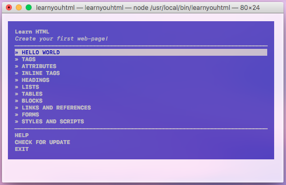

### 💛 LEARN YOU HTML 😎 



## Requirements

* [**Node.js**](node-url) >= 6.0.0

## Installation

Open your terminal and run this command:

```
npm install -g learnyouhtml
```

Use `sudo` if you get an `EACCESS` error.

## Usage

Open your terminal and run the following command:

```
learnyouhtml
```
